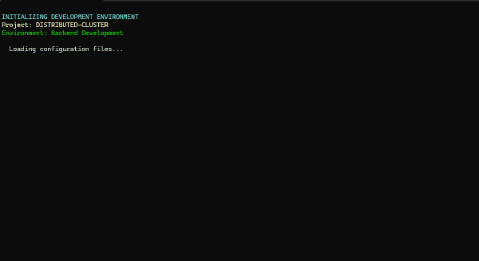

# C# stakeholder

The 100% organic C# port of the [Rust Stakeholder](https://github.com/giacomo-b/rust-stakeholder) project

Behold the **Awesomeness** Simulator for software engineers! Sure, some folks might call it **snarkware**, **sarcasticware**, or even **satireware**, but let's be honest: it's just plain old **Awesomware**.

Proudly powered by .NET 9 and your friendly neighborhood mega-corporation—because what’s more awesome than corporate synergy?

## Installation

* Clone repo

* Go to src folder

* dotnet run

* Bask in the glory of terminal awesomeness

